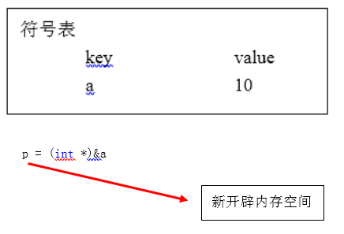
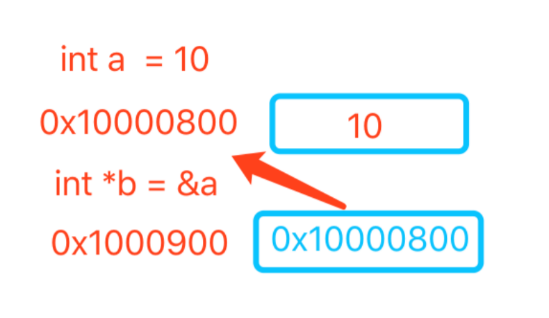

# 闲言碎语

1、三种简单排序的实现
2、合并算法的递归实现
3、红黑树的实现，可视化的视线
4、dot语言实现红黑树可视化，便于试错
5、项目结构搭建完毕

## 1. c/c++ 基本知识

### 符号常量

1. 变量就是程序内的一个内存位置的符号名，在该内存位置可以保存数据，通过符号名对该内存地址存放的数据进行访问
2. 变量在编译完后，变成汇编的时候就不存在了，全都是地址来表示，使用变量的时候，直接使用取该地址的值了
3. 变量不占用任何内存，只是为了让人更好的理解罢了

```c++
int a = 10;     // a 是变量，10是常量，也是整形常量
doub b = 3.5;   // b是变量，3.5是浮点型常量
char c = 'A';   // c是变量，'A'是字符常量
上述这些普通常量 10, 3.5, 'A'，在编译的时候被解析为立即数

const int d = 30; //符号常量，d是符号常量
# define PI 3.1415926
使用 const 修饰的常量叫做符号常量
通过 const 和 define 定义，并且是有名字的

不同之处在于: 
宏定义: 由预处理处理,单纯的是纯文本替换
const常量: 由 C++ 编译器处理,提供类型检查和作用域检查
建议把常量定义为const修饰的大写形式


1. C++ 编译器对const做了加强，当 C++ 编译器扫描到const常量声明时，它不会像C语言一样为const单独分配内存。
2. 而是会将d放到一个符号表里面，符号表的存在形式见下图。
3. 当对d变量取地址的时候，如语句 p = (int *)&d; 此时 C++ 编译器会为d单独的开辟一块内存空间，把此内存空间赋给指针p。
4. 相当于p指向一个新的内存地址空间，而 d 还是原来的那个符号表里的内容。

- C语言中，const量无论其初始化方式，都是被当作常变量处理；
- 在 C++中，根据其初始化方式的不同，const量可表现为常量，也可表现为常变量；

//性质为常量的const值，值与内存无关，值存在符号常量表里，编译阶段不去内存中寻址取值
//性质为常变量的const量，值与内存相关联，编译阶段需要去内存中寻址取值


常量存储在什么地方：

一个由 C/C++ 编译的程序占用的内存分为以下几个部分 
1、栈区（stack）— 由编译器自动分配释放，存放函数的参数值，局部变量的值等。其操作方式类似于数据结构中的栈。
2、堆区（heap） — 由程序员分配释放， 若程序员不释放，程序结束时可能由OS回收。
3、全局(静态)区（static）- 全局变量和静态变量的存储是放在一起的，初始化的两者在一块区域，未初始化的两者在另一块区域。
未初始化的全局变量和未初始化的静态变量在相邻的另一块区域，程序结束后由OS释放。
4、文字常量区 — 常量字符串就是放在这里的，程序结束后由OS释放。
5、程序代码区 — 存放函数体的二进制代码。

```



```int *, char *, double *的指针大小都是8字节长度，这样才能表示64位机器上的所有空间```


